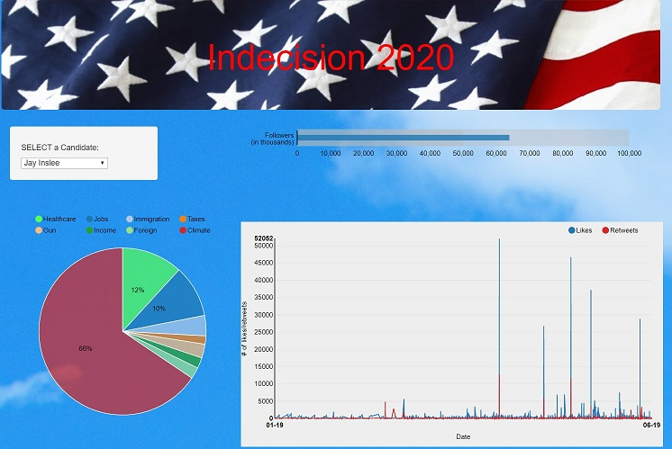

# Indecision 2020   https://frozen-cliffs-48809.herokuapp.com/

This app attempts to look at the current 2020 presidential candidates presence on twitter  
in terms of followers, retweets and 'liked' tweets (favorites). We also look at certain  
(pre-defined) terms to see how often the candidates are mentioning them in their tweets.  

We utilized the Twitter API with the python tweepy wrapper to get our data from each  
candidate's twitter account. We use MongoDB, Flask and javascript (nvd3) to build a dashboard  
plotting our findings. The app has been uploaded to Heroku and can be accessed at the  
above link.

You can select a Democrat candidate that will change each if the first three charts to track that candidates’ tweets: 
Bar chart that will track favorites
Pie chart that will track subjects being tweeted
And a line chart to track likes and Retweets 

The last two charts are a bar chart comparing likes and Retweets for all the democratic candidates 

we used Python script load_candidate_db.py to make the twitter API call and search for what we were looking for the place it in a remote mongo DB on Heroku. 

next we used Flask app.py connects to our Heroku mongoDB on Heroku DB We made three
route “/” returns index.html 
next route “/data/<chosenCandidate>” ,  getting  tweets from the mongoDB based on chosenCandidate

last route “/metadata”, will display from the data base the metadata and create a loop 
threw and append the output screen name candidate retweet avg favorite Avg and so on .  

index .html static folder has all the JavaScript files required to load the Graphs 
app.js loads the data and other JS files that are required. 
